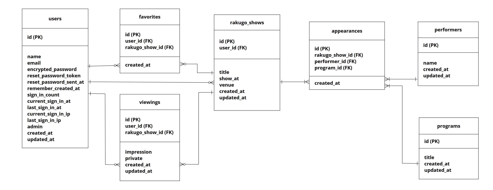
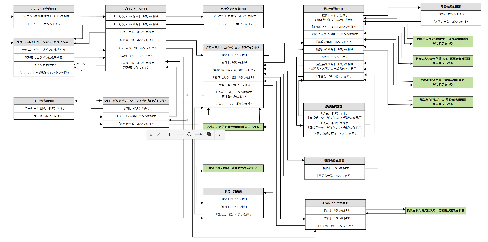

# README
## 開発言語
* ruby 3.0.1
* Rails 6.1.7.4
## 就職Termの技術
* gem devise
* お気に入り機能
## カリキュラム外の技術
* gem ransack
## 実行手順
```
$ git clone git@github.com:dejima-yuya/RakuRaku.git
$ cd RakuRaku
$ bundle install
$ yarn install
$ rails db:create && rails db:migrate
$ rails s
```
## カタログ設計
https://docs.google.com/spreadsheets/d/1SECdIW1-nu2nqOm48X8LOmmY20nMrMNmXS9C8yAKhz4/edit?usp=sharing
## テーブル定義書
https://docs.google.com/spreadsheets/d/1SECdIW1-nu2nqOm48X8LOmmY20nMrMNmXS9C8yAKhz4/edit?usp=sharing
## ワイヤーフレーム
https://cacoo.com/diagrams/ZpMO2POVke9xvkWv/D79FA
## ER図

## 画面遷移図

